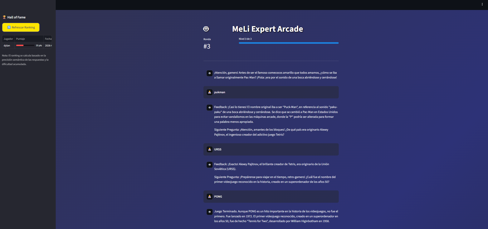

# 🚀 AI Tech Lead Technical Test

> **Candidato:** Dylan N. Sáenz  
> **Rol:** AI Tech Lead  
> **Enfoque:** Cloud-Native, Scalable AI Agents & User-Centric Design


Este repositorio contiene la solución integral a la prueba técnica. El proyecto demuestra capacidades de arquitectura de sistemas distribuidos (Ejercicio 1) e implementación de agentes cognitivos con persistencia y frontend interactivo (Ejercicio 2).

---

## 📂 Estructura del Proyecto

### 1. [Ejercicio 1: Arquitectura RAG Enterprise](./ejercicio_1/)
Diseño de sistema para preguntas y respuestas sobre documentación técnica masiva.
- **Artifacts:** Diagrama de Arquitectura (Excalidraw) y Documento de Diseño Técnico.
- **Key Features:**
    - ☁️ **Serverless-First:** Uso de Cloud Run y Eventarc para escalar a cero.
    - ⚡ **Cache Strategy:** Implementación de Redis para optimización de costos/latencia.
    - 📄 **Document AI:** Procesamiento avanzado de PDFs (tablas/imágenes).

### 2. [Ejercicio 2: Agente de Trivia "MeLi Arcade"](./ejercicio_2/)
Sistema Multi-Agente completo con Backend (FastAPI) y Frontend (Streamlit).
<br>


- **Core:** **LangGraph** (Stateful Multi-Agent System).
- **Modelo:** Google **Gemini 2.5 Flash** (via Vertex AI).
- **Interfaz:** App interactiva con gamificación, animaciones y ranking en tiempo real.
- **Datos:** Persistencia transaccional con **SQLModel** (SQLite/PostgreSQL ready).

---

## 🛠 Tech Stack & Herramientas

| Componente | Tecnología Seleccionada | Propósito |
| :--- | :--- | :--- |
| **Orquestación** | `LangGraph` | Control de flujo cíclico y memoria (State Management). |
| **LLM** | `Vertex AI` | Modelo generativo multimodal y de baja latencia. |
| **API** | `FastAPI` | Exposición del agente como microservicio REST. |
| **Frontend** | `Streamlit` | Interfaz de usuario interactiva para demostración rápida. |
| **ORM** | `SQLModel` | Gestión de base de datos y validación de esquemas (Pydantic). |
| **Config** | `Pydantic-Settings` | Gestión segura de variables de entorno (`.env`). |

---

## 🧠 Decisiones Técnicas y Justificación (Decision Log)

### ¿Por qué LangGraph en lugar de una cadena simple?
El requerimiento de un flujo cíclico (`Preguntar` -> `Esperar Input` -> `Evaluar` -> `Repetir`) con persistencia de estado hace que las cadenas lineales (LangChain LCEL) sean difíciles de mantener y escalar. **LangGraph** permite modelar esto como una **Máquina de Estados Finita (FSM)**, manejando la interrupción humana (`interrupt_before`) y la memoria entre turnos de manera nativa y robusta.

### ¿Por qué Arquitectura Desacoplada (FastAPI + Streamlit)?
En lugar de embeber la lógica dentro de la UI, se separó el núcleo en una **API REST**.
1.  **Escalabilidad:** El backend puede escalar independientemente del frontend.
2.  **Versatilidad:** Esta API podría ser consumida mañana por una app móvil (Unity/React) sin cambiar una línea de código del agente.
3.  **Profesionalismo:** Simula un entorno de producción real de microservicios.

### Estrategia de Prompting & Contexto
Se implementó una estrategia de **Context Injection** dinámica:
- **Prevención de Repetición:** El historial de preguntas previas se inyecta en el prompt del sistema para evitar bucles.
- **Structured Outputs:** Uso estricto de esquemas JSON Pydantic para garantizar que el LLM siempre devuelva formatos procesables, eliminando errores de parsing en tiempo de ejecución.

---

## 🚀 Quick Start (Cómo correr el Ejercicio 2)

Para ver el agente en acción con la interfaz gráfica:

1.  **Configurar Credenciales:**
    Asegúrate de tener tu archivo `.env` en `./ejercicio_2/` con tu `PROJECT_ID` de GCP.

2.  **Instalar Dependencias:**
    ```bash
    cd ejercicio_2
    python -m venv venv
    source venv/bin/activate  # o .\venv\Scripts\Activate en Windows
    pip install -r requirements.txt
    ```

3.  **Ejecutar el Sistema (Doble Terminal):**
    *Terminal 1 (Backend):*
    ```bash
    uvicorn src.api:app_api --reload
    ```
    *Terminal 2 (Frontend):*
    ```bash
    streamlit run src/frontend.py
    ```

---
**Autor:** Dylan N. Sáenz  
*Ready for the next challenge.*
