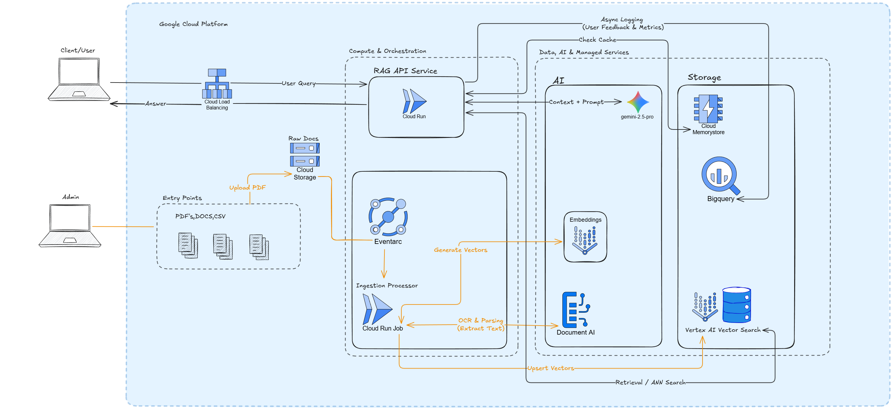

# 🏛️ Cloud-Native Enterprise RAG Architecture

> **Diseño de Sistema:** Dylan N. Sáenz  
> **Objetivo:** Sistema escalable de QA sobre documentación técnica masiva.  
> **Patrón:** Event-Driven Serverless RAG.

---

## 📐 Diagrama de Arquitectura

*(Si la imagen no carga, ver [versión SVG de alta calidad](./assets/arquitectura_rag.svg))*

---

## 🧠 Executive Summary

Esta arquitectura está diseñada para resolver la ingestión y consulta de manuales técnicos complejos bajo principios de **Serverless** y **NoOps**. Se prioriza la desacoplación de componentes para permitir el escalado independiente de la ingesta (procesamiento de PDFs) y la inferencia (Chatbot).

### Flujo de Datos (Data Flow)

1.  **Ingesta Asíncrona (ETL Pipeline):**
    *   La subida de documentos a **Cloud Storage** dispara un evento (Eventarc).
    *   Un **Cloud Run Job** procesa el archivo utilizando **Document AI** para estructurar tablas y diagramas (crítico en manuales técnicos).
    *   Los vectores se generan y almacenan en **Vertex AI Vector Search** para baja latencia.

2.  **Inferencia en Tiempo Real (Query Engine):**
    *   El usuario interactúa a través de un **Cloud Load Balancer**.
    *   La API (**Cloud Run**) orquesta la búsqueda.
    *   Implementación de **Semantic Caching (Redis)**: Antes de generar una respuesta costosa con el LLM, se verifica si la pregunta ya fue respondida, reduciendo costos y latencia.

---

## 🛠 Stack Tecnológico & Justificación

| Componente | Tecnología GCP | Por qué esta elección (Trade-offs) |
| :--- | :--- | :--- |
| **Compute** | `Cloud Run` | Escala a cero para ahorrar costos cuando no hay uso. Maneja concurrencia nativa. |
| **Orchestration** | `Eventarc` & `Jobs` | Arquitectura reactiva. Evita tener servidores encendidos esperando archivos. |
| **OCR / Parsing** | `Document AI` | Superior a librerías open-source (PyPDF) para extraer tablas y estructuras de manuales. |
| **Vector DB** | `Vertex AI Vector Search` | Escalabilidad masiva y baja latencia (<10ms) comparado con pgvector para altos volúmenes. |
| **Caching** | `Memorystore (Redis)` | Optimización FinOps. Reduce llamadas repetitivas al LLM ($$$). |
| **LLM** | `Gemini 1.5 Pro` | Ventana de contexto amplia (1M+ tokens) ideal para inyectar múltiples fragmentos de documentación. |

---

## 🛡️ Atributos de Calidad (Non-Functional Requirements)

*   **Escalabilidad:** El uso de Vector Search desacopla el almacenamiento del cómputo. El sistema soporta desde 5k hasta 50M de documentos sin rediseño.
*   **Observabilidad:** Loop de retroalimentación asíncrono hacia **BigQuery** para analizar la calidad de las respuestas y detectar "Drift" en los temas consultados.
*   **Seguridad:** Principio de menor privilegio usando Service Accounts específicas para cada Cloud Run (Identity-Based Security).

---

## 📥 Descargas y Recursos Adicionales

Para un análisis detallado y presentación ejecutiva:

*   📄 **[Documentación Técnica Completa (PDF)](./documentacion_rag.pdf)**: Explicación profunda de cada componente y flujos alternativos.
*   📊 **[Presentación Ejecutiva (PPTX)](./assets/presentacion.pptx)**: Slides para stakeholders no técnicos.
*   🖼️ **[Diagrama Fuente (SVG)](./assets/diagrama_rag.svg)**: Archivo editable en alta resolución.

---
**Tech Lead Candidate:** Dylan N. Sáenz